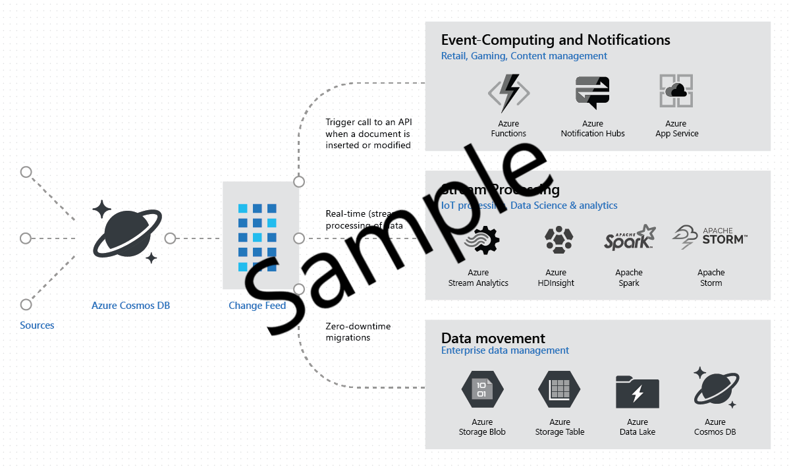
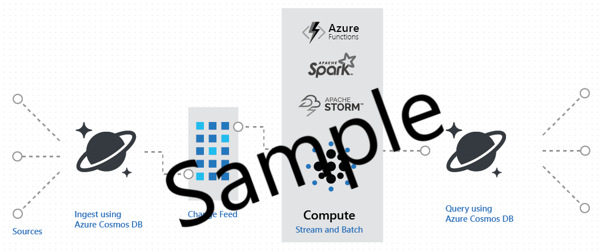
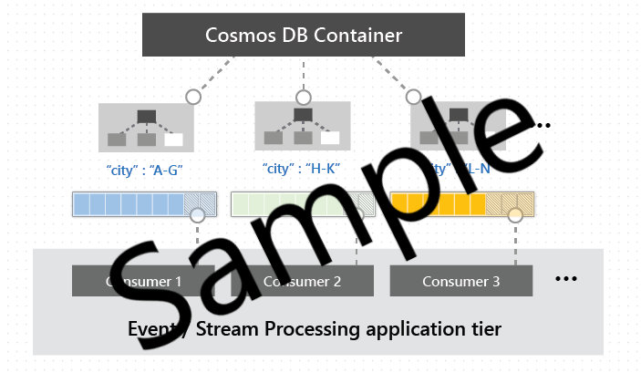

# Change Feed in Chorus - Overview

Change Feed support in Chorus works by listening for any changes made by a Publisher ([Actor](actor.md), [Data Feed](actor-data-feed.md), [Group](group.md), [User](user.md)) on the Chorus platform. It outputs the sorted list of the changes in the order in which they were modified. The changes can be processed asynchronously and incrementally, with the output distributed across all [subscribers](subscriber.md) for parallel processing. 

The Chorus platform is well-suited for IoT, streaming analytics, and operational logging. A common design pattern leveraging change feed are applications that use changes to the data to trigger additional actions. Examples of additional actions include:

* Triggering a notification or a call to an API, when an item is inserted or updated.
* Real-time stream analytics processing on operational data.
* Additional data movement by either synchronizing with a cache or a search engine or a data warehouse or archiving data to cold storage.

The change feed in Chorus enables you to build efficient and scalable solutions for each of these patterns, as shown in the following image:

# Change Feed operations

All operations on a publisher ([Actor](actor.md), [Data Feed](actor-data-feed.md), [Group](group.md), [User](user.md)) are written to the change feed. The functionality to control change feed for specific operations such as updates only and not inserts is available by applying [filters](change-feed-filter.md) to a change feed [subscription](change-feed-subscription.md). Additionally, dispatching can be controlled by using [check-pointing](change-feed-checkpoint.md) in order to apply temporal windowing and batching of notifications.

### Change Feed authentication and authorization

Change feed [subscriptions](change-feed-subscription.md) will automatically authenticate [on-behalf-of](../authentication/authentication-on-behalf-of.md) the owner of the subscription and limit the feed to the [scopes](../authorization/authorization-scopes.md) assigned to the [user](user.md) for the publisher instance.

### Sort order of items in change feed

Change feed items come in the order of their modification time. This sort order is guaranteed per Publisher instance.

### Change Feed across multiple regions

In Chorus' multi-region configuration, if a write-region fails, the change feed will work across the fail over operation and  remain contiguous.

### Change Feed and Time to Live (TTL)

By default the TTL (Time to Live) for [actors](actor.md), [groups](group.md), and [users](user.md) is infinite while a [data feed](actor-data-feed.md) can vary from five minutes to one year. If the change feed [subscriber](subscriber.md) does not process the change feed within the TTL interval for the subscription then an out-of-bands request to the [batch](batch.md) data layer is required to capture data associated with the change.  

## Change Feed use cases and scenarios

Change Feed enables efficient processing of large datasets with a high volume of writes. Change Feed also offers an alternative to querying an entire dataset to identify changes.

### Use cases

For example, with change feed you can perform the following tasks efficiently:

* Update a cache, update a search index, or update a data warehouse with data originating in Chorus.

* Implement a [subscriber](subscriber.md) with application-level data tiering and archival, for example, store "hot data" originating in Chorus and age out "cold data" to other storage systems.

* Implement [lambda architecture](https://blogs.technet.microsoft.com/msuspartner/2016/01/27/azure-partner-community-big-data-advanced-analytics-and-lambda-architecture/) using Chorus, where Chorus supports real-time, [batch](batch.md) and [query](query.md) serving layers, thereby enabling lambda architecture with low TCO.

* Receive and store event data from Chorus and process these events in real time, for example, using [Spark](apache-spark.md).  The following image shows how you can implement lambda architecture using Chorus via change feed:

### Scenarios

The following are some of the scenarios you can easily implement with the Chorus Change Feed:

* Within your web or mobile apps, you can track events such as changes in the charging state of a Dcbel device and trigger specific actions, for example, sending push notifications to their devices using [Azure Functions](change-feed-functions.md).

* If you're using Chorus to monitor a collection of [devices](device.md), for example, use the change feed to implement real-time aggregation of power consumption across the collection.

## Working with Change Feed

You can work with the Chorus change feed using the following options:

* [Using change feed with Azure Functions](change-feed-functions.md)
* [Using change feed with the Chorus client API](change-feed-processor.md) 
* [Using change feed with WebSockets](change-feed-websockets.md) 

The Chorus change feed is available for every [Actor](actor.md), [Device](device.md), [User](user.md), or [Group](group.md), and it can be distributed across any number of [subscribers](change-feed-subscriber.md) for parallel processing as shown in the image below.

## Features of Change Feed

* Change Feed is enabled by default for all [Actors](actor.md), [Devices](device.md), [Users](user.md), [Groups](group.md), and [Data Feeds](actor-data-feed.md).

* You can use your [provisioned throughput](request-units.md) to read from the change feed, just like any other Chorus operation and across all regions associated with your account.

* The change feed includes inserts and update operations made to a Publisher. You can capture deletes by reading the finite expiration period on the notification's [TTL](time-to-live.md). When an item is deleted, a value of zero (0) is assigned to the TTL. 

* Each change to an item appears exactly once in the change feed, and the [Subscriber](change-feed-subscriber.md) must manage filtering and check-pointing logic. If you want to avoid the complexity of managing filters or checkpoints, the change feed processor provides automatic [filtering](change-feed-filter.md) and [check-pointing](change-feed-checkpoint.md) using an "at least once" semantic. See [Using change feed with the Chorus Client API](change-feed-processor.md).

* Only the most recent change for a given item is included in the change feed. Intermediate changes may not be available if the [subscriber](change-feed-subscriber.md) does not process notifications quickly enough or the subscriber [subscriber](change-feed-subscriber.md) is configured using temporal windowing [checkpoints](change-feed-checkpoint.md).

* The change feed is sorted by the order of modification for a specific publisher. There is no guaranteed order across publisher instances.

* [Subscriptions](change-feed-subscriber.md) can be synchronized from any point-in-time (limited by the [TTL](time-to-live.md) of the publisher), that is there is no fixed data retention period for which changes are available.

* Changes are available in parallel across publisher instances. This capability allows changes from large number of publishers to be processed in parallel by multiple consumers. 

## Next steps

You can now proceed to learn more about change feed in the following articles:

* [Subscribing to a change feed](change-feed-subscriber.md)
* [Using change feed processor](change-feed-processor.md)
